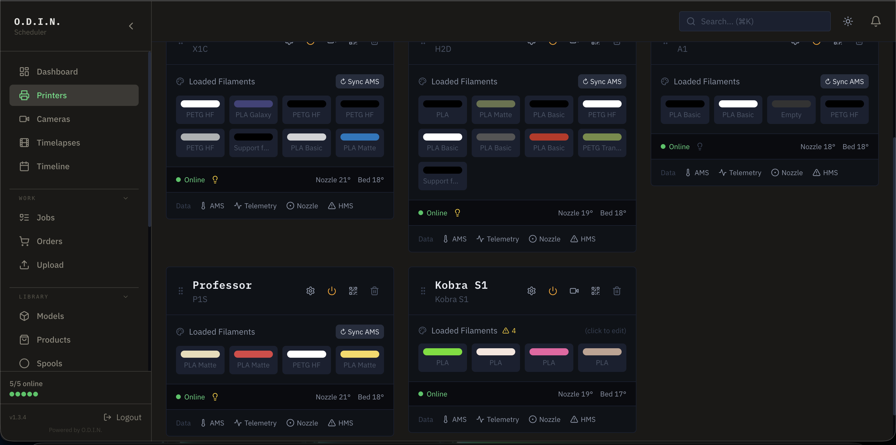
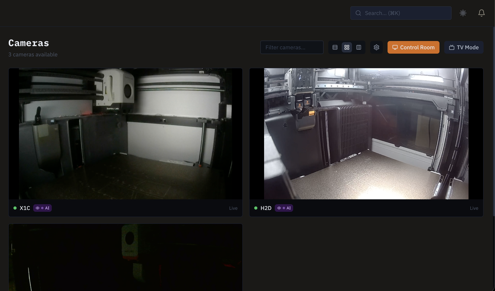

<div align="center">

# O.D.I.N.

**Self-hosted 3D print farm management**

[](https://github.com/HughKantsime/runsodin/releases)
[](LICENSE)
[](https://github.com/HughKantsime/runsodin/actions/workflows/ci.yml)
[](#)
[](https://github.com/HughKantsime/runsodin/pkgs/container/odin)
[](https://runsodin.com)

[Website](https://runsodin.com) · [Install](https://runsodin.com/install) · [Features](https://runsodin.com/features) · [Pricing](https://runsodin.com/pricing)

</div>

---

The only platform that combines multi-protocol printer support, AI failure detection, and full business operations in a single self-hosted container. No cloud dependency. No per-printer fees. Your data stays on your network.

## Key Features

- **Multi-Protocol Fleet** — Bambu MQTT, Klipper/Moonraker, PrusaLink, and Elegoo SDCP from one dashboard
- **Vigil AI Failure Detection** — ONNX-based spaghetti/detachment/first-layer detection with auto-pause
- **Smart Job Scheduling** — Color-match scoring, time-window matching, drag-and-drop queue
- **Mid-Print Controls** — Skip objects, adjust speed (25%–200%), and clear HMS errors during active prints
- **Print Archive** — Auto-captures every completed print with metadata, thumbnails, and searchable history
- **OBS Streaming Overlay** — Auth-free `/overlay/:printerId` page for live streaming with camera, progress, and temps
- **Order-to-Ship Workflow** — Products, BOM, orders, invoicing, cost tracking, and shipping in one system
- **WebRTC Camera Streaming** — Live feeds via go2rtc with control room mode, PiP, and timelapse capture
- **Spool Inventory** — Filament tracking with QR label printing, AMS integration, and drying logs
- **Enterprise Security** — RBAC (admin/operator/viewer), MFA, OIDC SSO, IP allowlisting, audit logs
- **Single Container Deploy** — One `docker compose up`, ~256 MB RAM, all 9 services included

## Quick Install

**Linux / macOS:**

```bash
curl -fsSL https://get.runsodin.com/install.sh | bash
```

**Windows (PowerShell):**

```powershell
irm https://raw.githubusercontent.com/HughKantsime/runsodin/master/install/install.ps1 | iex
```

See [Windows Installation Guide](install/WINDOWS_INSTALL.md) for detailed instructions.

**Or with Docker Compose directly:**

```bash
mkdir odin && cd odin
curl -O https://raw.githubusercontent.com/HughKantsime/runsodin/master/install/docker-compose.yml
docker compose up -d
```

Open `http://your-server-ip:8000` and follow the setup wizard.

## Screenshots

### Fleet Overview


### Camera Streaming


## Comparison

| | **O.D.I.N.** | SimplyPrint | 3DPrinterOS | Obico |
|---|---|---|---|---|
| **Annual cost (20 printers)** | **$150 flat** | $960-1,440 | $2,280+ | $960-1,440 |
| **Pricing model** | Flat license | Per-printer SaaS | Per-printer SaaS | Per-printer SaaS |
| **Self-hosted** | Yes | No | No | Partial |
| **Printer protocols** | 4 (Bambu, Klipper, Prusa, Elegoo) | 2 | Many (via agent) | OctoPrint only |
| **AI failure detection** | Included | Add-on ($) | No | Core product |
| **Business ops (orders/BOM/invoicing)** | Yes | No | No | No |
| **Air-gap / offline** | Yes | No | No | No |
| **MFA + SSO** | Yes | Yes | Yes | No |

## Stack

- **Backend** — Python 3.11, FastAPI, SQLAlchemy, SQLite (WAL mode)
- **Frontend** — React 18, Vite, TailwindCSS, React Query
- **Streaming** — go2rtc (WebRTC, RTSP)
- **AI** — ONNX Runtime (Vigil AI failure detection)
- **Deploy** — Docker, supervisord (9 managed processes)

## Documentation

- [Install Guide](https://runsodin.com/install) — Setup, configuration, and updating
- [Features](https://runsodin.com/features) — Full feature catalog
- [Pricing](https://runsodin.com/pricing) — Community, Pro, Education, Enterprise tiers
- [API Docs](https://runsodin.com) — Swagger UI at `/api/docs` on your running instance
- [CHANGELOG](CHANGELOG.md) — Version history
- [SECURITY](SECURITY.md) — Security policy and vulnerability reporting

## Community

- [Discord](https://discord.gg/odin-community) — Support and discussion
- [GitHub Issues](https://github.com/HughKantsime/runsodin/issues) — Bug reports and feature requests
- [runsodin.com](https://runsodin.com) — Website and documentation

## License

O.D.I.N. is licensed under the [Business Source License 1.1](LICENSE). Source-available, not open source.

- **Free** for personal and non-commercial use (Community tier: 5 printers, 1 user)
- **Commercial use** requires a paid license (Pro, Education, or Enterprise)
- **On 2029-02-07** the license converts to Apache 2.0

License keys are verified locally with Ed25519 signatures. No phone home, no cloud dependency.

---

<div align="center">

**[runsodin.com](https://runsodin.com)**

Built by [Sublab 3DP](https://runsodin.com)

</div>
